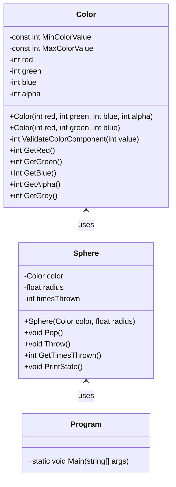

```mermaid
classDiagram
    class Color {
        -const int MinColorValue
        -const int MaxColorValue
        -int red
        -int green
        -int blue
        -int alpha
        +Color(int red, int green, int blue, int alpha)
        +Color(int red, int green, int blue)
        -int ValidateColorComponent(int value)
        +int GetRed()
        +int GetGreen()
        +int GetBlue()
        +int GetAlpha()
        +int GetGrey()
    }

    class Sphere {
        -Color color
        -float radius
        -int timesThrown
        +Sphere(Color color, float radius)
        +void Pop()
        +void Throw()
        +int GetTimesThrown()
        +void PrintState()
    }

    class Program {
        +static void Main(string[] args)
    }

    Color <-- Sphere : uses
    Sphere <-- Program : uses
```